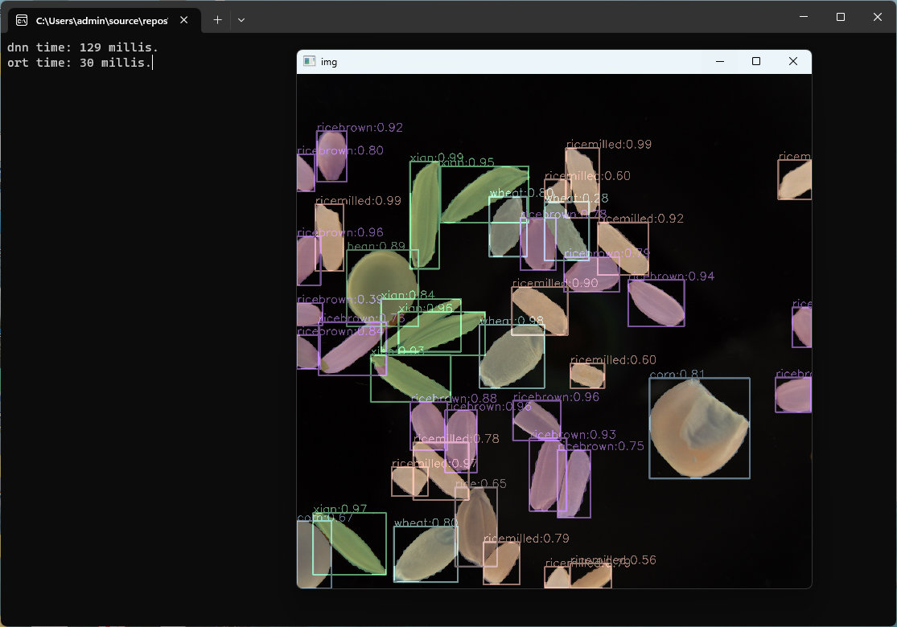

# yolov8 segmentation simplest demo 

### inference using opencv dnn and onnxruntime

### only one cpp file, less than 200 lines.

### the bestm.onnx is a demo model to segment the common grains.

### the project compiled under vs2022+opencv4.7+onnxruntime 1.15

### the onnxruntime installed using nuget, opencv installed using vcpkg

20230607

```c++
int main()
{
	srand(time(0));
	vector<Scalar> color;
	for (int i = 0; i < class_names.size(); i++)
	{
		color.push_back(Scalar(rand() % 128 + 128, rand() % 128 + 128, rand() % 128 + 128));
	}
	string model_path = "./bestm.onnx";
	Mat img1 = imread("./1.jpg");
	Mat img2 = img1.clone();
	vector<Obj> result;
	if (detect_seg_dnn(model_path, img1, result))
	{
		draw_result(img1, result, color);
	}
	if (detect_seg_ort(model_path, img2, result))
	{
		draw_result(img2, result, color);
	}
	return 0;
}

```

### detect_seg_dnn using opencv dnn net to infer

### detect_seg_ort using onnxruntime to infer




